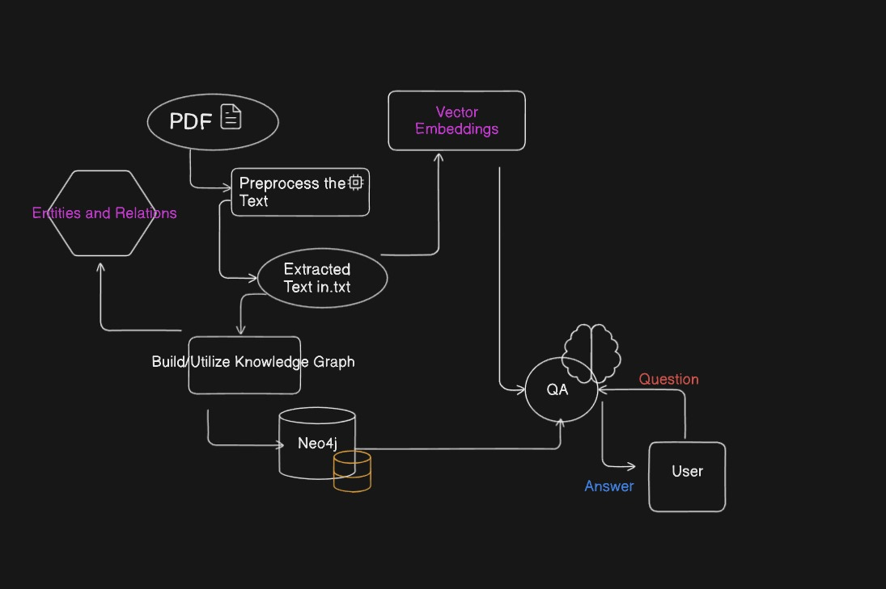

# Hybrid RAG Approach with Knowledge Graph

## Overview

This project implements a Hybrid Retrieval-Augmented Generation (RAG) approach with knowledge graphs for interacting with PDF documents. The system integrates several advanced techniques to enhance interaction with document-based data, combining text extraction, semantic understanding, and generative response generation.

## Flowchart

Below is the flowchart representing the process:


## File Structure

The project consists of the following Python scripts:

### 1. `extraction.py`
- **Purpose**: Extracts text from PDF documents.
- **Dependencies**: Uses the `llama-Index` library for parsing and extracting text.
- **How It Works**:
  - Converts PDF content into a machine-readable format.
  - Cleans and structures the extracted text for further processing.

### 2. `graphcreation.py`
- **Purpose**: Creates and populates a knowledge graph with entities and relationships.
- **Dependencies**: Requires libraries for knowledge graph creation and management.
- **How It Works**:
  - Processes the extracted text to identify key entities and relationships.
  - Constructs a knowledge graph that represents the semantic context of the document data.

### 3. `app.py`
- **Purpose**: Provides an interactive interface for querying the data using a Streamlit app.
- **Dependencies**: Streamlit for the web application interface.
- **How It Works**:
  - Allows users to input queries.
  - Retrieves relevant information from the PDF and the knowledge graph.
  - Uses a generative model to provide coherent and contextually relevant responses.

## Setup and Installation

1. **Clone the Repository**:
    ```bash
    git clone https://github.com/yourusername/your-repository.git
    cd your-repository
    ```

2. **Install Dependencies**:
    Ensure you have Python 3.7+ installed. Then install the necessary Python packages:
    ```bash
    pip install -r requirements.txt
    ```

3. **Run the Scripts**:
    - **Extract Text**:
      ```bash
      python extraction.py
      ```
    - **Create Knowledge Graph**:
      ```bash
      python graphcreation.py
      ```
    - **Start the Streamlit App**:
      ```bash
      streamlit run app.py
      I AM RUNNING OLAMA LOCALLY ON MY PC
      ```

## Usage

1. **Text Extraction**: Run `extraction.py` to process your PDF files and extract text.
2. **Knowledge Graph Creation**: Execute `graphcreation.py` to build and populate the knowledge graph.
3. **Interactive Querying**: Launch `app.py` using Streamlit to start the web interface. Enter queries in the app to interact with the document data and get responses.

## Benefits

- **Enhanced Accuracy**: Combines retrieval with knowledge graph-based contextual understanding for more accurate responses.
- **Contextual Understanding**: Utilizes the knowledge graph to provide deeper semantic insights and improved query handling.
- **Improved Interaction**: Offers a natural and intuitive way to interact with complex document-based information.

## Use Cases

- **Customer Support**: Answer detailed queries about product manuals or legal documents.
- **Research Assistance**: Aid researchers in extracting and understanding information from scientific papers.
- **Educational Tools**: Provide students with interactive learning tools based on textbooks and related knowledge.

## Feedback and Contributions

For feedback or to contribute to the project, please submit issues or pull requests via the [GitHub repository](https://github.com/HarshMN2345/HybridRAGapproach.git).

## License

This project is licensed under the MIT License. See the [LICENSE](LICENSE) file for more details.

---

